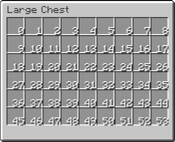

# Configuration Files

All the menu configuration files are located in `config/virtualchest/menu/` directory. If the plugin is installed for the first time, there will be two example files in the directory: `example.conf` and `example2.conf`. They represent two menus, whose names are `example` and `example2`.

## Structure

The structure of the configuration is usually like this:

```hocon
virtualchest {
  TextTitle = "Example"
  Rows = 6
  Slot0 {
    // configuration for slot 0 (1st slot)
  }
  Slot1 {
    // configuration for slot 1 (2nd slot)
  }
  Slot2 {
    // configuration for slot 2 (3rd slot)
  }
  TriggerItem {
    ItemType = "minecraft:compass"
  }
}
```

The example shown above contains the options commonly used to configure a menu.

All the configurations are surrounded by a `virtualchest` section, so you can put something out of this section for better readability, such as aliases. For example, if you want to set all the items in the menu to panes of stained glass, the configuration file could be like this:

```hocon
aliases {
  white-pane-item {
    // configuration of the white stained glass pane
  }
}
virtualchest {
  TextTitle = "Example"
  Rows = 6
  Slot0 = ${aliases.white-pane-item}
  Slot1 = ${aliases.white-pane-item}
  Slot2 = ${aliases.white-pane-item}
  // ...
  Slot52 = ${aliases.white-pane-item}
  Slot53 = ${aliases.white-pane-item}
  TriggerItem {
    ItemType = "minecraft:compass"
  }
}
```

For more information about HOCON, please refer to the related [documentation](https://github.com/typesafehub/config/blob/master/HOCON.md).

# General Options

### `TextTitle`

The value of this option should be a string, which represents the title of a menu.

Formatting codes starting with `&` could also be used to set the colors or styles of the title. For example, `&2` means dark green, `&l` means bold, etc.

```hocon
TextTitle = "Example" // the normal title, whose font color is black
TextTitle = "&1&lExample" // the bold title, whose font color is dark blue
```

Please refer to the [Minecraft Wiki](https://minecraft.gamepedia.com/Formatting_codes) for more details about the formatting codes.

### `Rows`

The value of this option should be a positive integer, which means how many rows the menu should have.

In theory, any positive number is acceptable, but in fact, a number greater than 6 will affect the players' game experience.

### `Slot0`, `Slot1`, etc.

The value of this option could be either a section or a list of sections. If it is a section, it will describe the items in a particular slot directly. If it is a list, the menu will choose the first section, the item described by which meets the requirements.

For more information about slot configuration and requirements, please refer to [this page](3-Slots-And-Requirements.md).

the number as the suffix of the option indicates the location of the slot as the picture shows:



### `TriggerItem`

This value of this option should describe an item for opening the menu. For example:

```hocon
TriggerItem {
    ItemType = "minecraft:compass"
}
```

The example says that if a player left clicks or right clicks a compass held in the hand, the corresponding menu will be opened.

You can also set the `UnsafeDamage` to tell the plugin that only if the item meta matches will the menu be opened like this:

```
// Both coal and charcoal can open the menu
TriggerItem {
    ItemType = "minecraft:coal"
}
// Only the coal can open it
TriggerItem {
    ItemType = "minecraft:coal"
    UnsafeDamage = 0
}
// Only the charcoal does
TriggerItem {
    ItemType = "minecraft:coal"
    UnsafeDamage = 1
}
```

You can also set the `EnablePrimaryAction` or `EnableSecondaryAction` option to `false` to tell the plugin if the player can open the menu by left clicking or right clicking the item:

```
// Only right clicking can the player open the menu
TriggerItem {
    ItemType = "minecraft:compass"
    EnablePrimaryAction = false
}
// Only left clicking does
TriggerItem {
    ItemType = "minecraft:compass"
    EnableSecondaryAction = false
}
// Neither left nor right clicking does, but why do you want to do this?
TriggerItem {
    ItemType = "minecraft:compass"
    EnableSecondaryAction = false
    EnablePrimaryAction = false
}
```

# Other Options

// TODO
