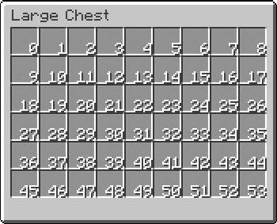

# 配置文件

所有菜单的配置文件都放置于 `config/virtualchest/menu/` 目录之下，如果本插件是第一次运行，将会在此目录下生成两个样例菜单文件`example.conf`和`example2.conf`。他们代表了两个菜单，分别名为`example`和`example2`。

## 结构

配置文件的结构基本如下所示：

```hocon
virtualchest {
  TextTitle = "Example"
  Rows = 6
  Slot0 {
    // 编号为0的格子的配置 (第一栏/槽)
  }
  Slot1 {
    // 编号为1的格子的配置 (第二栏/槽)
  }
  Slot2 {
    // 编号为2的格子的配置 (第三栏/槽)
  }
  TriggerItem {
    ItemType = "minecraft:compass"
  }
}
```

上面的示例包含了配置菜单中常用的选项。

所有的配置信息都会被放置在`virtualchest`部分只内，所有你可以您可以讲一些注释性文本放置在这部分之外来提高文件的可读性，就像`aliases`。例如，如果您想将菜单中所有的物品设置为玻璃板，配置文件可以写成这样：

```hocon
aliases {
  white-pane-item {
    // configuration of the white stained glass pane
  }
}
virtualchest {
  TextTitle = "Example"
  Rows = 6
  Slot0 = ${aliases.white-pane-item}
  Slot1 = ${aliases.white-pane-item}
  Slot2 = ${aliases.white-pane-item}
  // ...
  Slot52 = ${aliases.white-pane-item}
  Slot53 = ${aliases.white-pane-item}
  TriggerItem {
    ItemType = "minecraft:compass"
  }
}
```

如果您想了解更多的关于HOCON的资料，请参考这个[文档](https://github.com/typesafehub/config/blob/master/HOCON.md)。

# 常规项

### `TextTitle`

本项所对应的值应该为字符串，这个字符串将对应于箱子菜单的标题。

您可以通过 `&` 字符为标题格式化文字，例如 `&2` 代表深绿， `&l`代表加粗等等。

```hocon
TextTitle = "Example" //常规标题，黑色字体。
TextTitle = "&1&lExample" //加粗标题，深蓝加粗字体。
```

如果您想了解更多关于格式化文字的技巧，请参考[Minecraft Wiki](https://minecraft.gamepedia.com/Formatting_codes)。

### `Rows`

本项所对应的值应该是一个正整数，这个数将定义所在菜单的行数。

理论上，任何正整数都是本项的合法参数，但是实际中，大于6的数字将会导致玩家的显示问题。

### `Slot0`, `Slot1`等

本项所对应的值可以是一个部分也可以是几个部分，如果只是一个部分的话，它将直接描述指定槽位的物品。如果对应的值是几个部分，菜单会优先选择符合要求的第一个部分。

如果您想了解更多关于槽（Slot）的配置方法，请参考[本词条](3-Slots-And-Requirements.md)。

作为选项后缀的数字表示插槽的位置，如图片所示：



### `TriggerItem`

本项所对应的值应该是一个物品ID，玩家将会通过对应的物品打开本项所在菜单，例如：

```hocon
TriggerItem {
    ItemType = "minecraft:compass"
}
```

这个示例演示了如果一个玩家手持一个指南针左键或者右键单击，那么相对于的菜单将会被激活并呈现给他。

您也可以通过设置`UnsafeDamage`项对应的值来告诉插件，只能通过指定损耗值的物品来激活菜单，例如这样：

```
//煤和碳都能激活指定菜单（煤和木炭）
TriggerItem {
    ItemType = "minecraft:coal"
}
//只能通过煤激活
TriggerItem {
    ItemType = "minecraft:coal"
    UnsafeDamage = 0
}
//只能通过炭激活
TriggerItem {
    ItemType = "minecraft:coal"
    UnsafeDamage = 1
}
```

您也可以通过将`EnablePrimaryAction`或者`EnableSecondaryAction`项设置为`false`来禁止玩家用相应的方法激活菜单，例如这样：

```
//玩家只能通过右键单击来激活菜单
TriggerItem {
    ItemType = "minecraft:compass"
    EnablePrimaryAction = false
}
//玩家只能通过左键单击来激活菜单
TriggerItem {
    ItemType = "minecraft:compass"
    EnableSecondaryAction = false
}
//玩家既不能通过右键来激活菜单，也不能通过左键单击来激活菜单(噗。。。)
TriggerItem {
    ItemType = "minecraft:compass"
    EnableSecondaryAction = false
    EnablePrimaryAction = false
}
```

# 其他项

// 续不续看心情
